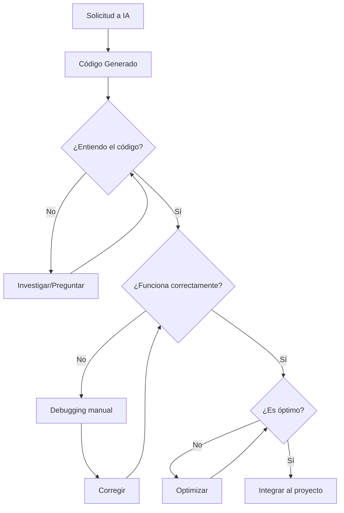

# 🤖 Uso de Inteligencia Artificial en el Desarrollo

<p align="center">
  
  
  
</p>

---

## 🛠️ Herramientas de IA Utilizadas

### 1. v0 by Vercel
**URL**: [v0.dev](https://v0.dev)

**Descripción**: Plataforma de generación de código con IA especializada en React, Next.js y componentes de UI.

| Aspecto | Detalle |
|---------|---------|
| **Tipo** | Generador de código / Asistente de desarrollo |
| **Modelo** | Claude (Anthropic) |
| **Uso principal** | Generación de componentes, arquitectura, debugging |

---

## 📍 Áreas donde se utilizó IA

### ✅ Diseño de Interfaz de Usuario

| Componente | Uso de IA | Nivel de modificación |
|------------|-----------|----------------------|
| Landing Page | Generación inicial + ajustes | 70% IA / 30% manual |
| Dashboard Layout | Estructura base | 60% IA / 40% manual |
| Sidebar | Generación completa | 80% IA / 20% manual |
| Formularios | Generación con shadcn/ui | 75% IA / 25% manual |
| Tablas y listas | Templates base | 65% IA / 35% manual |

### ✅ Lógica de Backend

| Funcionalidad | Uso de IA | Comprensión |
|---------------|-----------|-------------|
| API Routes | Estructura y patrones | Alta |
| Autenticación Supabase | Integración guiada | Alta |
| Queries SQL | Generación y optimización | Alta |
| Row Level Security | Políticas RLS | Alta |
| Triggers PostgreSQL | Lógica de stock | Alta |

### ✅ Configuración y DevOps

| Área | Uso de IA |
|------|-----------|
| Estructura del proyecto | Organización de carpetas |
| Variables de entorno | Configuración segura |
| Middleware de autenticación | Implementación |
| Manejo de errores | Patrones consistentes |

---

## 📝 Tipos de Ayuda Recibida

### 1. Generación de Código
```
Solicitud: "Crea un componente de tabla para mostrar productos con 
           búsqueda, filtros y paginación"

Resultado: Componente completo con:
           - Tabla responsiva
           - Barra de búsqueda
           - Filtros por categoría
           - Estados de loading/empty
```

### 2. Debugging y Solución de Problemas
```
Problema: "Las políticas RLS no permiten insertar en usuario_empresa"

Solución IA: Identificó que search_path estaba vacío en las funciones
             helper, corrigió con SET search_path = public
```

### 3. Arquitectura y Patrones
```
Consulta: "¿Cómo estructurar la autenticación multi-tenant con Supabase?"

Respuesta: Patrón con:
           - Tabla usuario_empresa para relación N:M
           - Funciones helper (fn_empresa_del_usuario)
           - Políticas RLS usando las funciones
           - Middleware para verificar sesión
```

### 4. Optimización
```
Solicitud: "Optimiza las consultas del dashboard"

Mejoras: 
- Índices adicionales sugeridos
- Queries paralelas en lugar de secuenciales
- Uso de vistas materializadas para reportes
```

---

## 🧠 Comprensión del Código Generado

### Nivel de Comprensión: **ALTO**

| Área | Comprensión | Justificación |
|------|-------------|---------------|
| **React/Next.js** | ⭐⭐⭐⭐⭐ | Experiencia previa + documentación revisada |
| **TypeScript** | ⭐⭐⭐⭐⭐ | Tipado comprendido y personalizado |
| **SQL/PostgreSQL** | ⭐⭐⭐⭐⭐ | Queries analizadas y optimizadas manualmente |
| **Supabase Auth** | ⭐⭐⭐⭐ | Flujo completo entendido |
| **RLS Policies** | ⭐⭐⭐⭐⭐ | Escritas y debuggeadas manualmente |
| **Tailwind CSS** | ⭐⭐⭐⭐⭐ | Clases conocidas y personalizadas |

### Evidencia de Comprensión

1. **Modificaciones post-generación**: Todo el código generado fue revisado y modificado según necesidades específicas del proyecto.

2. **Debugging manual**: Errores como el `search_path` vacío en funciones RLS fueron identificados y corregidos entendiendo el problema de fondo.

3. **Extensiones propias**: Funcionalidades como el sistema de alertas y reportes personalizados fueron desarrolladas entendiendo los patrones existentes.

4. **Optimizaciones**: Mejoras de rendimiento implementadas con conocimiento de cómo funcionan SWR, React y PostgreSQL.

---

## ⚖️ Balance IA vs Desarrollo Manual

```
┌─────────────────────────────────────────────────────┐
│                                                     │
│   IA Generativa                  Desarrollo Manual  │
│   ████████████░░░░░░░░░░░░░░░░░░░░░░░░░░░████████  │
│        35%                              65%         │
│                                                     │
│   • Scaffolding inicial         • Lógica de negocio│
│   • Componentes UI base         • Integración BD   │
│   • Patrones comunes            • Debugging        │
│   • Documentación               • Optimización     │
│                                 • Personalización  │
│                                                     │
└─────────────────────────────────────────────────────┘
```

---

## 🎯 Uso Crítico de IA

### Lo que SÍ hice con IA:
- ✅ Acelerar el scaffolding inicial
- ✅ Generar componentes de UI repetitivos
- ✅ Obtener ejemplos de patrones de código
- ✅ Debugging de errores complejos
- ✅ Generación de documentación

### Lo que NO hice con IA:
- ❌ Copiar código sin entenderlo
- ❌ Delegar decisiones arquitectónicas críticas
- ❌ Ignorar errores o warnings generados
- ❌ Usar código sin probarlo exhaustivamente

---

## 📚 Aprendizajes

### Técnicos
1. **Supabase RLS**: Comprendí a profundidad cómo funcionan las políticas de seguridad a nivel de fila.
2. **Next.js App Router**: Entendí la diferencia entre Server y Client Components.
3. **PostgreSQL Triggers**: Aprendí a crear triggers para mantener integridad de datos.

### Sobre uso de IA
1. **Validar siempre**: El código generado puede tener errores sutiles.
2. **Entender antes de usar**: Es fundamental comprender qué hace cada línea.
3. **Iterar**: La primera generación raramente es perfecta.
4. **Combinar fuentes**: IA + documentación oficial = mejor resultado.

---

## 🔍 Proceso de Validación



---

## ✍️ Declaración

Declaro que:

1. **Entiendo** completamente el código utilizado en este proyecto
2. **Puedo explicar** cada componente, función y query SQL
3. **Soy capaz** de modificar, extender y debuggear cualquier parte
4. **He verificado** que todo el código funciona correctamente
5. **El uso de IA** fue como herramienta de productividad, no como reemplazo del aprendizaje

---

<p align="center">
  <em>La IA es una herramienta poderosa cuando se usa con criterio y comprensión.</em>
</p>
