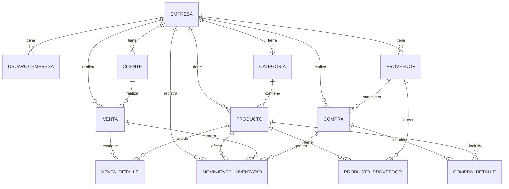

# 🗃️ Diseño de Base de Datos

<p align="center">
  
  
</p>

---

## 📊 Diagrama Entidad-Relación



---

## 📋 Tablas Principales

### 🏢 `empresa`
Almacena la información de cada empresa/negocio registrado.

| Columna | Tipo | Descripción |
|---------|------|-------------|
| `id` | UUID | Identificador único (PK) |
| `nombre` | TEXT | Nombre de la empresa |
| `email` | TEXT | Email único de contacto |
| `telefono` | TEXT | Teléfono de contacto |
| `direccion` | TEXT | Dirección física |
| `id_fiscal` | TEXT | Cédula jurídica |
| `logo_url` | TEXT | URL del logo |
| `activo` | BOOLEAN | Estado de la cuenta |
| `creado_en` | TIMESTAMPTZ | Fecha de creación |
| `actualizado_en` | TIMESTAMPTZ | Última actualización |

---

### 👤 `usuario_empresa`
Tabla de relación entre usuarios de Supabase Auth y empresas (multi-tenant).

| Columna | Tipo | Descripción |
|---------|------|-------------|
| `id_usuario` | UUID | ID del usuario (auth.uid()) |
| `id_empresa` | UUID | ID de la empresa (FK) |
| `rol` | rol_usuario | Rol: admin, operador, viewer |
| `creado_en` | TIMESTAMPTZ | Fecha de asignación |

**PK**: (id_usuario, id_empresa)

---

### 📦 `producto`
Catálogo de productos de cada empresa.

| Columna | Tipo | Descripción |
|---------|------|-------------|
| `id` | UUID | Identificador único (PK) |
| `id_empresa` | UUID | Empresa propietaria (FK) |
| `id_categoria` | UUID | Categoría del producto (FK) |
| `nombre` | TEXT | Nombre del producto |
| `descripcion` | TEXT | Descripción detallada |
| `sku` | TEXT | Código único por empresa |
| `precio_costo` | NUMERIC(12,2) | Precio de compra |
| `precio_venta` | NUMERIC(12,2) | Precio de venta |
| `stock` | INTEGER | Cantidad actual |
| `stock_minimo` | INTEGER | Nivel mínimo de alerta |
| `activo` | BOOLEAN | Producto activo |
| `creado_en` | TIMESTAMPTZ | Fecha de creación |
| `actualizado_en` | TIMESTAMPTZ | Última actualización |

**Constraints**:
- `UNIQUE (id_empresa, sku)`
- `CHECK (precio_costo >= 0)`
- `CHECK (precio_venta >= 0)`
- `CHECK (stock >= 0)`

---

### 🏷️ `categoria`
Categorías para organizar productos.

| Columna | Tipo | Descripción |
|---------|------|-------------|
| `id` | UUID | Identificador único (PK) |
| `id_empresa` | UUID | Empresa propietaria (FK) |
| `nombre` | TEXT | Nombre de categoría |
| `descripcion` | TEXT | Descripción |
| `creado_en` | TIMESTAMPTZ | Fecha de creación |

**Constraints**: `UNIQUE (id_empresa, nombre)`

---

### 🔄 `movimiento_inventario`
Registro de todos los movimientos de stock.

| Columna | Tipo | Descripción |
|---------|------|-------------|
| `id` | UUID | Identificador único (PK) |
| `id_empresa` | UUID | Empresa (FK) |
| `id_producto` | UUID | Producto afectado (FK) |
| `id_venta` | UUID | Venta relacionada (FK, opcional) |
| `id_compra` | UUID | Compra relacionada (FK, opcional) |
| `tipo` | tipo_movimiento | Tipo de movimiento |
| `cantidad` | INTEGER | Cantidad movida |
| `stock_antes` | INTEGER | Stock antes del movimiento |
| `stock_despues` | INTEGER | Stock después del movimiento |
| `motivo` | TEXT | Razón del movimiento |
| `creado_en` | TIMESTAMPTZ | Fecha del movimiento |

---

### 🛒 `venta` y `venta_detalle`
Ventas y su detalle de productos.

**venta:**
| Columna | Tipo | Descripción |
|---------|------|-------------|
| `id` | UUID | PK |
| `id_empresa` | UUID | FK |
| `id_cliente` | UUID | Cliente (FK, opcional) |
| `numero` | INTEGER | Número de venta |
| `estado` | estado_venta | pendiente, completada, cancelada |
| `subtotal` | NUMERIC | Subtotal |
| `descuento` | NUMERIC | Descuento aplicado |
| `impuesto` | NUMERIC | Impuesto |
| `monto_total` | NUMERIC | Total a pagar |
| `metodo_pago` | metodo_pago_tipo | Forma de pago |

---

### 📥 `compra` y `compra_detalle`
Compras a proveedores y su detalle.

Similar estructura a ventas, con estado: pendiente, recibida, parcial, cancelada.

---

## 🔢 Tipos Enumerados

```sql
-- Tipos de movimiento de inventario
CREATE TYPE tipo_movimiento AS ENUM (
    'entrada',           -- Ingreso de mercadería
    'salida',            -- Venta/consumo
    'ajuste_positivo',   -- Corrección +
    'ajuste_negativo',   -- Corrección -
    'devolucion_venta',  -- Cliente devuelve
    'devolucion_compra'  -- Devuelve a proveedor
);

-- Estados de venta
CREATE TYPE estado_venta AS ENUM (
    'pendiente',
    'completada',
    'cancelada',
    'anulada'
);

-- Roles de usuario
CREATE TYPE rol_usuario AS ENUM (
    'admin',    -- Control total
    'operador', -- Operaciones diarias
    'viewer'    -- Solo lectura
);

-- Métodos de pago
CREATE TYPE metodo_pago_tipo AS ENUM (
    'efectivo',
    'tarjeta',
    'transferencia',
    'credito',
    'otro'
);
```

---

## ⚡ Funciones y Triggers

### Funciones Helper

```sql
-- Obtener empresa del usuario autenticado
CREATE FUNCTION fn_empresa_del_usuario()
RETURNS UUID AS $$
    SELECT id_empresa 
    FROM usuario_empresa 
    WHERE id_usuario = auth.uid() 
    LIMIT 1;
$$ LANGUAGE sql STABLE SECURITY DEFINER;

-- Obtener rol del usuario autenticado
CREATE FUNCTION fn_rol_del_usuario()
RETURNS TEXT AS $$
    SELECT rol::TEXT 
    FROM usuario_empresa 
    WHERE id_usuario = auth.uid() 
    LIMIT 1;
$$ LANGUAGE sql STABLE SECURITY DEFINER;
```

### Trigger: Actualización de Stock Automática

```sql
-- Al completar una venta, descuenta stock automáticamente
CREATE FUNCTION fn_trigger_venta_estado()
RETURNS TRIGGER AS $$
BEGIN
    IF NEW.estado = 'completada' AND OLD.estado != 'completada' THEN
        -- Descontar stock de cada producto
        FOR det IN SELECT * FROM venta_detalle WHERE id_venta = NEW.id LOOP
            PERFORM fn_registrar_movimiento(...);
        END LOOP;
    END IF;
    RETURN NEW;
END;
$$ LANGUAGE plpgsql;
```

### Trigger: Timestamps Automáticos

```sql
-- Actualiza actualizado_en automáticamente
CREATE FUNCTION fn_set_actualizado_en()
RETURNS TRIGGER AS $$
BEGIN
    NEW.actualizado_en = NOW();
    RETURN NEW;
END;
$$ LANGUAGE plpgsql;
```

---

## 🔐 Row Level Security (RLS)

### Políticas de Seguridad

Cada tabla tiene políticas que aseguran el aislamiento de datos:

```sql
-- Política SELECT para producto
CREATE POLICY pol_producto_select ON producto
  FOR SELECT TO public
  USING (id_empresa = fn_empresa_del_usuario());

-- Política INSERT para producto
CREATE POLICY pol_producto_insert ON producto
  FOR INSERT TO public
  WITH CHECK (
    id_empresa IN (
      SELECT id_empresa FROM usuario_empresa WHERE id_usuario = auth.uid()
    )
  );

-- Política UPDATE para producto
CREATE POLICY pol_producto_update ON producto
  FOR UPDATE TO public
  USING (id_empresa = fn_empresa_del_usuario())
  WITH CHECK (id_empresa = fn_empresa_del_usuario());

-- Política DELETE para producto
CREATE POLICY pol_producto_delete ON producto
  FOR DELETE TO public
  USING (id_empresa = fn_empresa_del_usuario());
```

---

## 📊 Vistas

### `v_historial_inventario`
Vista para consultar movimientos con datos del producto.

```sql
CREATE VIEW v_historial_inventario AS
SELECT 
    m.id,
    m.id_empresa,
    m.creado_en,
    p.nombre AS producto,
    p.sku,
    m.tipo,
    m.cantidad,
    m.stock_antes,
    m.stock_despues,
    m.motivo
FROM movimiento_inventario m
JOIN producto p ON m.id_producto = p.id;
```

---

## 📈 Índices

```sql
-- Índices para optimizar consultas frecuentes
CREATE INDEX idx_producto_empresa ON producto(id_empresa);
CREATE INDEX idx_producto_categoria ON producto(id_categoria);
CREATE INDEX idx_producto_sku ON producto(id_empresa, sku);
CREATE INDEX idx_mov_producto ON movimiento_inventario(id_producto);
CREATE INDEX idx_mov_empresa_fecha ON movimiento_inventario(id_empresa, creado_en DESC);
```

---

## 📝 Justificación del Diseño

1. **Multi-tenant con RLS**: Permite que múltiples empresas usen la misma base de datos de forma segura y aislada.

2. **UUIDs como PK**: Evita conflictos en sistemas distribuidos y mejora la seguridad.

3. **Timestamps automáticos**: Triggers mantienen `actualizado_en` siempre correcto.

4. **Stock calculado por triggers**: El stock se actualiza automáticamente con cada movimiento, garantizando integridad.

5. **Tipos enumerados**: Validan datos a nivel de base de datos, previniendo errores.

6. **Constraints CHECK**: Aseguran que precios y stocks no sean negativos.
