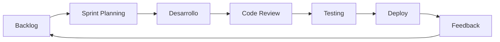

# 🔮 Roadmap - Funcionalidades Pendientes

  
  

---

## 📊 Estado Actual del Proyecto

| Área | Progreso | Estado |
|------|----------|--------|
| Autenticación | 100% | ✅ Completo |
| Gestión de Productos | 100% | ✅ Completo |
| Movimientos de Inventario | 100% | ✅ Completo |
| Dashboard | 100% | ✅ Completo |
| Reportes Básicos | 100% | ✅ Completo |
| Alertas de Stock | 100% | ✅ Completo |
| Ventas y Compras | 30% | 🔄 En progreso |
| Multi-usuario | 50% | 🔄 En progreso |
| Reportes Avanzados | 40% | 🔄 En progreso |

**Progreso Total: ~78%**

---

## 📋 Funcionalidades Pendientes

### 🔴 Alta Prioridad

| Funcionalidad | Descripción | Estimado |
|---------------|-------------|----------|
| **Módulo de Ventas** | Completar flujo de ventas con POS simple | Semana 1-2 |
| **Módulo de Compras** | Gestión de órdenes de compra a proveedores | Semana 2-3 |
| **Gestión de Proveedores** | CRUD de proveedores con historial | Semana 2 |
| **Gestión de Clientes** | CRUD de clientes con historial de compras | Semana 2 |

### 🟡 Media Prioridad

| Funcionalidad | Descripción | Estimado |
|---------------|-------------|----------|
| **Roles y Permisos** | Implementar permisos granulares por rol | Semana 3 |
| **Multi-usuario** | Invitar usuarios a la empresa | Semana 3 |
| **Reportes PDF** | Exportar reportes en formato PDF | Semana 3-4 |
| **Código de Barras** | Escaneo y generación de códigos | Semana 4 |
| **Notificaciones Email** | Alertas por correo electrónico | Semana 4 |

### 🟢 Baja Prioridad

| Funcionalidad | Descripción | Estimado |
|---------------|-------------|----------|
| **App Móvil PWA** | Versión móvil instalable | Semana 5+ |
| **Integraciones** | API para sistemas externos | Semana 5+ |
| **Temas Personalizados** | Personalización visual por empresa | Semana 5+ |
| **Facturación Electrónica** | Integración con Hacienda CR | Futuro |

---

## 📅 Cronograma Detallado

### Semana 1 (22-28 Abril 2026)

| Día | Tarea | Estado |
|-----|-------|--------|
| Lun | Finalizar documentación del proyecto | ⏳ |
| Mar | Implementar formulario de ventas básico | ⏳ |
| Mié | Conectar ventas con actualización de stock | ⏳ |
| Jue | Testing de flujo de ventas | ⏳ |
| Vie | Corregir bugs identificados | ⏳ |

### Semana 2 (29 Abril - 5 Mayo 2026)

| Día | Tarea | Estado |
|-----|-------|--------|
| Lun | CRUD de proveedores | ⏳ |
| Mar | CRUD de clientes | ⏳ |
| Mié | Módulo de compras (inicio) | ⏳ |
| Jue | Módulo de compras (finalización) | ⏳ |
| Vie | Integración ventas + compras | ⏳ |

### Semana 3 (6-12 Mayo 2026)

| Día | Tarea | Estado |
|-----|-------|--------|
| Lun | Sistema de roles y permisos | ⏳ |
| Mar | Invitación de usuarios | ⏳ |
| Mié | UI de gestión de equipo | ⏳ |
| Jue | Reportes avanzados (inicio) | ⏳ |
| Vie | Testing de multi-usuario | ⏳ |

### Semana 4 (13-19 Mayo 2026)

| Día | Tarea | Estado |
|-----|-------|--------|
| Lun | Exportación PDF | ⏳ |
| Mar | Sistema de notificaciones | ⏳ |
| Mié | Soporte código de barras | ⏳ |
| Jue | Testing general | ⏳ |
| Vie | Preparación para despliegue final | ⏳ |

### Semana 5 (20-26 Mayo 2026)

| Día | Tarea | Estado |
|-----|-------|--------|
| Lun | Bug fixes finales | ⏳ |
| Mar | Optimización de rendimiento | ⏳ |
| Mié | Documentación de usuario | ⏳ |
| Jue | Despliegue de producción | ⏳ |
| Vie | Presentación final | ⏳ |

---

## 🚀 Posibles Mejoras Futuras

### Optimizaciones Técnicas

- [ ] Implementar caché con Redis
- [ ] Lazy loading de componentes
- [ ] Optimización de queries SQL
- [ ] CDN para assets estáticos
- [ ] Service Worker para offline

### Nuevas Funcionalidades

- [ ] **Dashboard personalizable**: Widgets arrastrables
- [ ] **Predicción de demanda**: IA para stock óptimo
- [ ] **Integración bancaria**: Conciliación automática
- [ ] **Multi-sucursal**: Gestión de varias ubicaciones
- [ ] **Marketplace**: Catálogo público de productos

### Integraciones

- [ ] **WooCommerce**: Sincronización de inventario
- [ ] **Shopify**: Conexión con tienda online
- [ ] **QuickBooks**: Sincronización contable
- [ ] **WhatsApp**: Notificaciones y pedidos
- [ ] **Google Sheets**: Exportación automática

---

## 📈 Métricas de Éxito

| Métrica | Objetivo | Actual |
|---------|----------|--------|
| Tiempo de carga | < 2s | ~1.5s |
| Uptime | 99.9% | 99.5% |
| Errores por sesión | < 1% | ~0.5% |
| Satisfacción usuario | > 4.5/5 | N/A |

---

## 💡 Ideas de la Comunidad

Funcionalidades sugeridas por usuarios:

1. **Modo offline**: Trabajar sin conexión
2. **Import masivo**: Cargar productos desde Excel
3. **Historial de precios**: Tracking de cambios
4. **Notas en productos**: Comentarios internos
5. **Etiquetas**: Sistema de tags personalizado

---

## 🔄 Proceso de Desarrollo

---

## 📞 Contribuir

¿Tienes ideas para mejorar Invora?

1. Abre un **Issue** en GitHub
2. Describe la funcionalidad deseada
3. Participa en la discusión
4. ¡Contribuye con código si quieres!

---

  <em>Este roadmap se actualiza semanalmente según el progreso del proyecto.</em>

